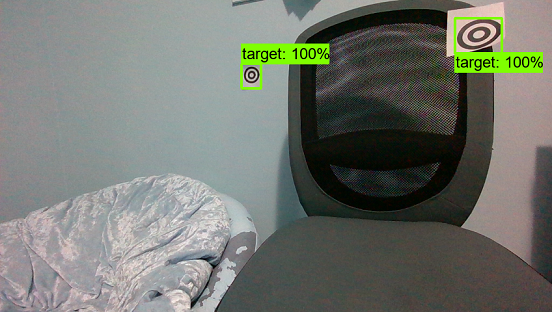
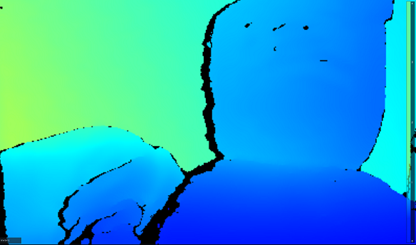
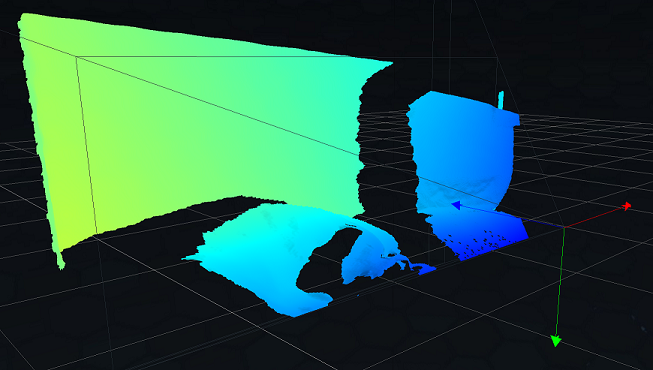
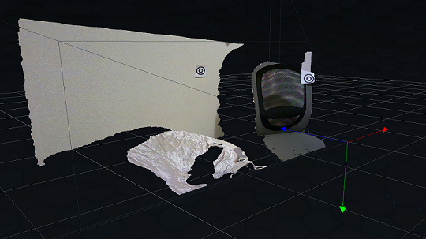
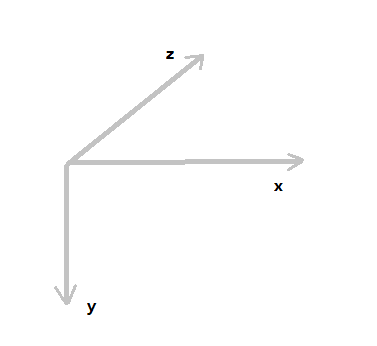

# Realsense Depth Detection
This script works with the Realsense camera and Tensorflow models output the depth of an detected object in real time.

## Running the Script
- Connect Realsense camera
- cd inside ``/TargetDetection/`` and run ``detection_checkpoint.py``.
- PNGs with detection bounding boxes will be generated from camera feed, along with debugging information on the console.

## Files
``/TargetDetection/data`` -- object label map for Tensorflow model

``/TargetDetection/models`` -- trained Tensorflow model

``/scripts/`` -- source python scripts

## Example
Running the script with a simple image classification model trained on ring-target objects yields the following detection:



Output (two outputs for two detected objects):
```
Bounding box coords:
[1.010, 0.873, 1.321]
[1.010, 0.992, 1.335]
[1.323, 0.871, 1.326]
[1.323, 0.991, 1.327]
Avg depth over bounding box:
1.332

Bounding box coords:
[2.278, 0.512, 0.657]
[2.282, 0.411, 0.713]
[2.393, 0.529, 0.704]
[2.391, 0.417, 0.598]
Avg depth over bounding box:
0.632
```

Depth map (from realsense app):



3-D view of depth map (from realsense app):


3-D view with colored frame as texture (from realsense app):


## Coordinate Interpretation


The 3D coordinate is based on a coordinate system where the origin is (close to) the center pixel of the color frame, and the x,y axis extends along the perimeter of the color frame, while z is the detected perpendicular distance from the x,y plane to the object.


## Error Estimation
Under **1m** to the object, depth data has accuracy of **+-1cm**;
At around **1-2m** to the object, depth data has accuracy of **+-5cm**

The x, y coordinates are also accurate to **+-5cm**
